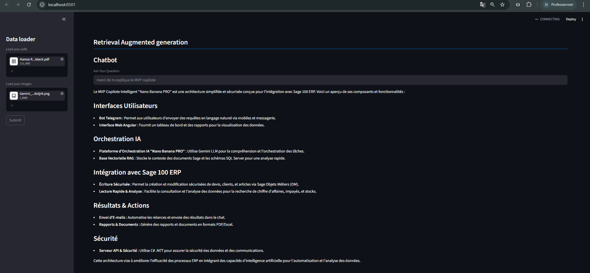

# AI Agent RAG multi-model

Projet RAG multimodal (texte + image) pour experimentation Agentic AI.




Le point d'entree principal est `rag.py`. Cette application combine les idees des notebooks:

- `rag-multimodel/rag-multimodel.ipynb` (RAG image avec ChromaDB + OpenCLIP)
- `RAG-text.ipynb` (RAG texte, chunking et retrieval)


## Objectif

Construire un assistant qui:

1. Indexe des PDF pour un retrieval textuel.
2. Indexe des images pour un retrieval visuel par similarite.
3. Repond aux questions en exploitant le contexte texte et, si disponible, les images retrouvees.

## Composants

- `rag.py`: application Streamlit principale (production/demo) RAG text+image.
- `rag-multimodel/rag-multimodel.ipynb`: laboratoire image retrieval + prompt vision.
- `RAG-text.ipynb`: laboratoire RAG texte .

## Architecture globale

```text
Question utilisateur
	|
	+--> Retrieval texte (Chroma + embeddings texte)
	|
	+--> Retrieval image (Chroma + OpenCLIP)
	|
	+--> Fusion du contexte (texte + images)
	|
	+--> LLM (ChatOpenAI) -> reponse finale
```

## Prerequis

- Python `>=3.11`
- Cle API OpenAI dans `.env`
- Dependances Python du projet

## Installation

```powershell
python -m venv .venv
.venv\Scripts\activate
pip install -e .
```

Alternative avec uv:

```powershell
uv sync
```

## Configuration

Creer un fichier `.env` a la racine:

```env
OPENAI_API_KEY=your_openai_key
```

## Lancer l'application principale

```powershell
streamlit run rag.py
```

## Documentation detaillee

- Voir `README-rag.py.md` pour le module principal.
- Voir `rag-multimodel/README.md` pour le notebook multimodal image.
- Voir `README-RAG-text.md` pour le notebook RAG-text texte.

## Arborescence

```text
TP3-AI-Agent-RAG/
|-- rag.py
|-- README.md
|-- README-rag.py.md
|-- README-RAG-text.md
|-- RAG-text.ipynb
|-- rag-multimodel/
|   |-- README.md
|   `-- rag-multimodel.ipynb
|-- pdfs/
|-- img/
|-- store/
`-- images-store-vdb/
```

## Limites actuelles

- Les index sont crees au clic `Submit` dans Streamlit.
- Le resultat multimodal depend de la disponibilite de 2 images pertinentes.
- Pas de trace explicite des sources (pages PDF + score) dans la reponse finale.

## Roadmap recommandee

1. Afficher les sources texte et scores image dans l'UI.
2. Ajouter un mode fallback multimodal avec 1 seule image.
3. Ajouter des tests d'integration sur pipeline d'indexation.
4. Introduire une couche d'evaluation (RAGAS ou jeu de questions maison).

## Auteur

RABIH Hamza

---

Projet pedagogique Agentic AI, avec une implementation app (`rag.py`) qui combine `rag-multimodel.ipynb` et `RAG-text.ipynb`.

